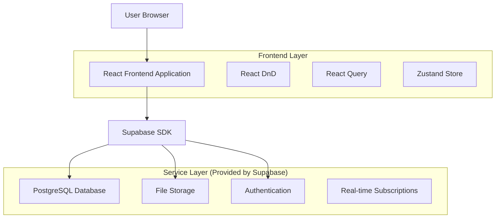
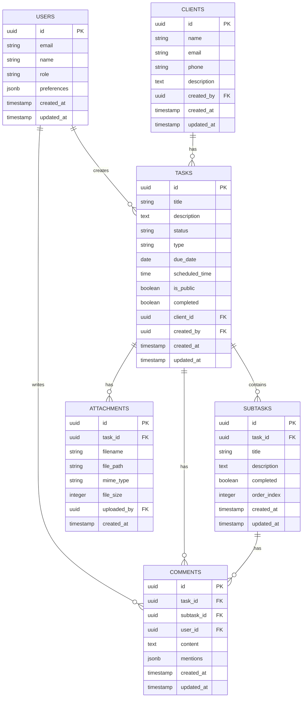

# Tarefeiro Pro - Documento de Arquitetura Técnica

## 1. Architecture design



## 2. Technology Description

- Frontend: React@18 + TypeScript@5 + Vite@5 + TailwindCSS@3
- Backend: Supabase (PostgreSQL + Auth + Storage + Real-time)
- State Management: Zustand@4
- Data Fetching: React Query@5
- Drag & Drop: React Beautiful DnD@13
- Date Management: date-fns@3
- Icons: Lucide React@0.400
- File Upload: React Dropzone@14

## 3. Route definitions

| Route | Purpose |
|-------|---------|
| / | Dashboard principal com visão geral e navegação |
| /kanban | Visualização kanban com drag and drop |
| /lista | Visualização em lista com filtros avançados |
| /agenda | Agenda diária e semanal |
| /tarefa/:id | Detalhes completos da tarefa |
| /clientes | Gerenciamento de clientes |
| /configuracoes | Configurações do usuário e sistema |
| /login | Página de autenticação |

## 4. API definitions

### 4.1 Core API

**Autenticação (Supabase Auth)**
```typescript
// Login
supabase.auth.signInWithPassword({
  email: string,
  password: string
})

// Registro
supabase.auth.signUp({
  email: string,
  password: string,
  options: { data: { name: string, role: string } }
})
```

**Gerenciamento de Tarefas**
```typescript
// Buscar tarefas
GET /rest/v1/tasks
Query Parameters:
- status?: string
- client_id?: string
- user_id?: string
- order?: string

// Criar tarefa
POST /rest/v1/tasks
Body: {
  title: string,
  description?: string,
  due_date?: string,
  client_id?: string,
  status: string,
  is_public: boolean,
  type: 'task' | 'event',
  scheduled_time?: string
}

// Atualizar tarefa
PATCH /rest/v1/tasks?id=eq.{id}
Body: Partial<Task>

// Deletar tarefa
DELETE /rest/v1/tasks?id=eq.{id}
```

**Gerenciamento de Subtarefas**
```typescript
// Buscar subtarefas
GET /rest/v1/subtasks?task_id=eq.{task_id}

// Criar subtarefa
POST /rest/v1/subtasks
Body: {
  task_id: string,
  title: string,
  description?: string,
  completed: boolean
}
```

**Sistema de Comentários**
```typescript
// Buscar comentários
GET /rest/v1/comments?task_id=eq.{task_id}

// Criar comentário
POST /rest/v1/comments
Body: {
  task_id: string,
  subtask_id?: string,
  content: string,
  mentions?: string[]
}
```

**Upload de Arquivos**
```typescript
// Upload de anexo
POST /storage/v1/object/task-attachments/{task_id}/{filename}
Content-Type: multipart/form-data

// Buscar anexos
GET /rest/v1/attachments?task_id=eq.{task_id}
```

## 5. Data model

### 5.1 Data model definition



### 5.2 Data Definition Language

**Tabela de Usuários (users)**
```sql
-- Estende a tabela auth.users do Supabase
CREATE TABLE public.user_profiles (
    id UUID PRIMARY KEY REFERENCES auth.users(id) ON DELETE CASCADE,
    name VARCHAR(100) NOT NULL,
    role VARCHAR(20) DEFAULT 'user' CHECK (role IN ('admin', 'authorized', 'user')),
    preferences JSONB DEFAULT '{"theme": "light", "notifications": true}',
    created_at TIMESTAMP WITH TIME ZONE DEFAULT NOW(),
    updated_at TIMESTAMP WITH TIME ZONE DEFAULT NOW()
);

-- RLS Policies
ALTER TABLE user_profiles ENABLE ROW LEVEL SECURITY;
CREATE POLICY "Users can view own profile" ON user_profiles FOR SELECT USING (auth.uid() = id);
CREATE POLICY "Users can update own profile" ON user_profiles FOR UPDATE USING (auth.uid() = id);

-- Grants
GRANT SELECT ON user_profiles TO anon;
GRANT ALL PRIVILEGES ON user_profiles TO authenticated;
```

**Tabela de Clientes (clients)**
```sql
CREATE TABLE clients (
    id UUID PRIMARY KEY DEFAULT gen_random_uuid(),
    name VARCHAR(100) NOT NULL,
    email VARCHAR(255),
    phone VARCHAR(20),
    description TEXT,
    created_by UUID REFERENCES auth.users(id) ON DELETE CASCADE,
    created_at TIMESTAMP WITH TIME ZONE DEFAULT NOW(),
    updated_at TIMESTAMP WITH TIME ZONE DEFAULT NOW()
);

-- Índices
CREATE INDEX idx_clients_created_by ON clients(created_by);
CREATE INDEX idx_clients_name ON clients(name);

-- RLS Policies
ALTER TABLE clients ENABLE ROW LEVEL SECURITY;
CREATE POLICY "Users can view own clients" ON clients FOR SELECT USING (created_by = auth.uid());
CREATE POLICY "Users can manage own clients" ON clients FOR ALL USING (created_by = auth.uid());

-- Grants
GRANT SELECT ON clients TO anon;
GRANT ALL PRIVILEGES ON clients TO authenticated;
```

**Tabela de Tarefas (tasks)**
```sql
CREATE TABLE tasks (
    id UUID PRIMARY KEY DEFAULT gen_random_uuid(),
    title VARCHAR(200) NOT NULL,
    description TEXT,
    status VARCHAR(20) DEFAULT 'para_fazer' CHECK (status IN ('para_fazer', 'fazendo', 'aguardando_retorno', 'feito', 'longo_prazo')),
    type VARCHAR(10) DEFAULT 'task' CHECK (type IN ('task', 'event')),
    due_date DATE,
    scheduled_time TIME,
    is_public BOOLEAN DEFAULT false,
    completed BOOLEAN DEFAULT false,
    client_id UUID REFERENCES clients(id) ON DELETE SET NULL,
    created_by UUID REFERENCES auth.users(id) ON DELETE CASCADE,
    created_at TIMESTAMP WITH TIME ZONE DEFAULT NOW(),
    updated_at TIMESTAMP WITH TIME ZONE DEFAULT NOW()
);

-- Índices
CREATE INDEX idx_tasks_status ON tasks(status);
CREATE INDEX idx_tasks_created_by ON tasks(created_by);
CREATE INDEX idx_tasks_client_id ON tasks(client_id);
CREATE INDEX idx_tasks_due_date ON tasks(due_date);
CREATE INDEX idx_tasks_type ON tasks(type);

-- RLS Policies
ALTER TABLE tasks ENABLE ROW LEVEL SECURITY;
CREATE POLICY "Users can view public tasks or own tasks" ON tasks FOR SELECT 
    USING (is_public = true OR created_by = auth.uid());
CREATE POLICY "Users can manage own tasks" ON tasks FOR ALL USING (created_by = auth.uid());

-- Grants
GRANT SELECT ON tasks TO anon;
GRANT ALL PRIVILEGES ON tasks TO authenticated;
```

**Tabela de Subtarefas (subtasks)**
```sql
CREATE TABLE subtasks (
    id UUID PRIMARY KEY DEFAULT gen_random_uuid(),
    task_id UUID REFERENCES tasks(id) ON DELETE CASCADE,
    title VARCHAR(200) NOT NULL,
    description TEXT,
    completed BOOLEAN DEFAULT false,
    order_index INTEGER DEFAULT 0,
    created_at TIMESTAMP WITH TIME ZONE DEFAULT NOW(),
    updated_at TIMESTAMP WITH TIME ZONE DEFAULT NOW()
);

-- Índices
CREATE INDEX idx_subtasks_task_id ON subtasks(task_id);
CREATE INDEX idx_subtasks_order ON subtasks(task_id, order_index);

-- RLS Policies
ALTER TABLE subtasks ENABLE ROW LEVEL SECURITY;
CREATE POLICY "Users can view subtasks of accessible tasks" ON subtasks FOR SELECT 
    USING (EXISTS (
        SELECT 1 FROM tasks 
        WHERE tasks.id = subtasks.task_id 
        AND (tasks.is_public = true OR tasks.created_by = auth.uid())
    ));
CREATE POLICY "Users can manage subtasks of own tasks" ON subtasks FOR ALL 
    USING (EXISTS (
        SELECT 1 FROM tasks 
        WHERE tasks.id = subtasks.task_id 
        AND tasks.created_by = auth.uid()
    ));

-- Grants
GRANT SELECT ON subtasks TO anon;
GRANT ALL PRIVILEGES ON subtasks TO authenticated;
```

**Tabela de Comentários (comments)**
```sql
CREATE TABLE comments (
    id UUID PRIMARY KEY DEFAULT gen_random_uuid(),
    task_id UUID REFERENCES tasks(id) ON DELETE CASCADE,
    subtask_id UUID REFERENCES subtasks(id) ON DELETE CASCADE,
    user_id UUID REFERENCES auth.users(id) ON DELETE CASCADE,
    content TEXT NOT NULL,
    mentions JSONB DEFAULT '[]',
    created_at TIMESTAMP WITH TIME ZONE DEFAULT NOW(),
    updated_at TIMESTAMP WITH TIME ZONE DEFAULT NOW()
);

-- Índices
CREATE INDEX idx_comments_task_id ON comments(task_id);
CREATE INDEX idx_comments_subtask_id ON comments(subtask_id);
CREATE INDEX idx_comments_user_id ON comments(user_id);
CREATE INDEX idx_comments_created_at ON comments(created_at DESC);

-- RLS Policies
ALTER TABLE comments ENABLE ROW LEVEL SECURITY;
CREATE POLICY "Users can view comments on accessible tasks" ON comments FOR SELECT 
    USING (EXISTS (
        SELECT 1 FROM tasks 
        WHERE tasks.id = comments.task_id 
        AND (tasks.is_public = true OR tasks.created_by = auth.uid())
    ));
CREATE POLICY "Users can create comments on accessible tasks" ON comments FOR INSERT 
    WITH CHECK (EXISTS (
        SELECT 1 FROM tasks 
        WHERE tasks.id = comments.task_id 
        AND (tasks.is_public = true OR tasks.created_by = auth.uid())
    ));

-- Grants
GRANT SELECT ON comments TO anon;
GRANT ALL PRIVILEGES ON comments TO authenticated;
```

**Tabela de Anexos (attachments)**
```sql
CREATE TABLE attachments (
    id UUID PRIMARY KEY DEFAULT gen_random_uuid(),
    task_id UUID REFERENCES tasks(id) ON DELETE CASCADE,
    filename VARCHAR(255) NOT NULL,
    file_path VARCHAR(500) NOT NULL,
    mime_type VARCHAR(100),
    file_size INTEGER,
    uploaded_by UUID REFERENCES auth.users(id) ON DELETE CASCADE,
    created_at TIMESTAMP WITH TIME ZONE DEFAULT NOW()
);

-- Índices
CREATE INDEX idx_attachments_task_id ON attachments(task_id);
CREATE INDEX idx_attachments_uploaded_by ON attachments(uploaded_by);

-- RLS Policies
ALTER TABLE attachments ENABLE ROW LEVEL SECURITY;
CREATE POLICY "Users can view attachments of accessible tasks" ON attachments FOR SELECT 
    USING (EXISTS (
        SELECT 1 FROM tasks 
        WHERE tasks.id = attachments.task_id 
        AND (tasks.is_public = true OR tasks.created_by = auth.uid())
    ));
CREATE POLICY "Users can manage attachments of own tasks" ON attachments FOR ALL 
    USING (EXISTS (
        SELECT 1 FROM tasks 
        WHERE tasks.id = attachments.task_id 
        AND tasks.created_by = auth.uid()
    ));

-- Grants
GRANT SELECT ON attachments TO anon;
GRANT ALL PRIVILEGES ON attachments TO authenticated;
```

**Dados Iniciais**
```sql
-- Inserir status padrão se necessário
INSERT INTO tasks (title, description, status, created_by) VALUES
('Tarefa de Exemplo', 'Esta é uma tarefa de exemplo para demonstração', 'para_fazer', auth.uid())
ON CONFLICT DO NOTHING;

-- Função para atualizar updated_at automaticamente
CREATE OR REPLACE FUNCTION update_updated_at_column()
RETURNS TRIGGER AS $$
BEGIN
    NEW.updated_at = NOW();
    RETURN NEW;
END;
$$ language 'plpgsql';

-- Triggers para updated_at
CREATE TRIGGER update_user_profiles_updated_at BEFORE UPDATE ON user_profiles FOR EACH ROW EXECUTE FUNCTION update_updated_at_column();
CREATE TRIGGER update_clients_updated_at BEFORE UPDATE ON clients FOR EACH ROW EXECUTE FUNCTION update_updated_at_column();
CREATE TRIGGER update_tasks_updated_at BEFORE UPDATE ON tasks FOR EACH ROW EXECUTE FUNCTION update_updated_at_column();
CREATE TRIGGER update_subtasks_updated_at BEFORE UPDATE ON subtasks FOR EACH ROW EXECUTE FUNCTION update_updated_at_column();
CREATE TRIGGER update_comments_updated_at BEFORE UPDATE ON comments FOR EACH ROW EXECUTE FUNCTION update_updated_at_column();
```