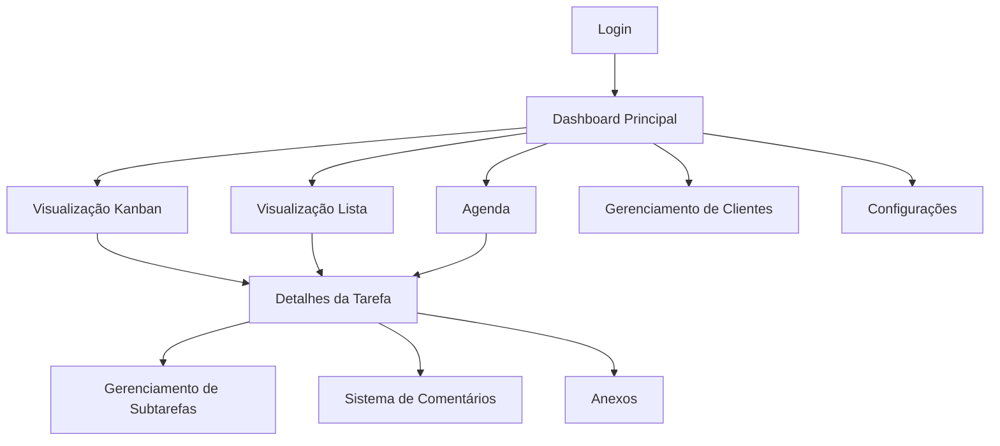

# Tarefeiro Pro - Documento de Requisitos do Produto

## 1. Product Overview

O Tarefeiro Pro é um sistema completo de gerenciamento de tarefas e eventos que oferece visualizações flexíveis (lista e kanban) com interface limpa e profissional. O sistema permite organização eficiente de tarefas com subtarefas, comentários colaborativos, sistema de agenda integrado e controle de visibilidade para equipes.

O produto resolve a necessidade de profissionais e equipes que precisam de uma ferramenta robusta para gerenciar tarefas complexas, eventos e projetos de forma organizada, sem poluição visual, com foco na produtividade e colaboração.

## 2. Core Features

### 2.1 User Roles

| Role | Registration Method | Core Permissions |
|------|---------------------|------------------|
| Administrador | Criação da conta principal | Acesso total, gerenciamento de usuários, configurações globais |
| Usuário Autorizado | Convite do administrador | Visualizar tarefas públicas, criar tarefas próprias, comentar |
| Usuário Padrão | Registro por convite | Visualizar apenas tarefas atribuídas, comentar quando mencionado |

### 2.2 Feature Module

O sistema Tarefeiro Pro consiste nas seguintes páginas principais:

1. **Dashboard Principal**: visão geral de tarefas, estatísticas rápidas, acesso às diferentes visualizações
2. **Visualização Kanban**: colunas de status, drag and drop, filtros e ordenação
3. **Visualização Lista**: lista detalhada de tarefas, filtros avançados, ordenação múltipla
4. **Agenda**: visualização diária e semanal, tarefas no topo, eventos em horários específicos
5. **Detalhes da Tarefa**: modal/página com informações completas, subtarefas, comentários
6. **Gerenciamento de Clientes**: cadastro e associação de clientes às tarefas
7. **Configurações**: preferências do usuário, dark mode, notificações
8. **Autenticação**: login, registro e recuperação de senha

### 2.3 Page Details

| Page Name | Module Name | Feature description |
|-----------|-------------|---------------------|
| Dashboard Principal | Visão Geral | Exibir estatísticas de tarefas por status, tarefas recentes, agenda do dia |
| Dashboard Principal | Navegação Rápida | Botões para alternar entre visualizações (kanban, lista, agenda) |
| Visualização Kanban | Colunas de Status | Exibir 5 colunas fixas: Para fazer, Fazendo, Aguardando retorno, Feito, Tarefas de longo prazo |
| Visualização Kanban | Drag and Drop | Arrastar cards entre colunas alterando status automaticamente |
| Visualização Kanban | Filtros e Ordenação | Filtrar por cliente, data de criação, data de conclusão, responsável |
| Visualização Lista | Lista de Tarefas | Exibir tarefas em formato tabular com colunas customizáveis |
| Visualização Lista | Filtros Avançados | Filtrar por múltiplos critérios simultaneamente |
| Visualização Lista | Ordenação Múltipla | Ordenar por data de criação, conclusão, cliente, prioridade |
| Agenda | Visualização Diária | Mostrar tarefas no topo e eventos em horários específicos |
| Agenda | Visualização Semanal | Visão compacta da semana com detalhes suficientes |
| Agenda | Marcação de Conclusão | Marcar tarefas/eventos como concluídos diretamente na agenda |
| Detalhes da Tarefa | Informações Principais | Exibir título, descrição, data de entrega, cliente associado |
| Detalhes da Tarefa | Gerenciamento de Subtarefas | Criar, editar, excluir e marcar subtarefas como concluídas |
| Detalhes da Tarefa | Sistema de Comentários | Comentários gerais na lateral, comentários específicos por subtarefa |
| Detalhes da Tarefa | Menções de Usuários | Mencionar usuários autorizados em comentários |
| Detalhes da Tarefa | Anexos | Upload e gerenciamento de arquivos anexos |
| Detalhes da Tarefa | Controle de Visibilidade | Checkbox "Visível para todos" para administradores |
| Gerenciamento de Clientes | Cadastro de Clientes | Criar, editar e excluir clientes |
| Gerenciamento de Clientes | Associação de Tarefas | Vincular tarefas específicas a clientes |
| Configurações | Preferências Visuais | Alternar entre modo claro e dark mode |
| Configurações | Configurações de Notificação | Gerenciar alertas e lembretes |
| Autenticação | Login/Registro | Autenticação segura com recuperação de senha |

## 3. Core Process

### Fluxo do Administrador
1. Faz login no sistema
2. Acessa o dashboard principal com visão geral
3. Cria nova tarefa definindo título, descrição, cliente e data de entrega
4. Adiciona subtarefas conforme necessário
5. Define visibilidade (privada ou pública)
6. Visualiza tarefas no kanban ou lista conforme preferência
7. Arrasta cards no kanban para alterar status
8. Abre detalhes da tarefa para adicionar comentários ou anexos
9. Menciona usuários autorizados em comentários
10. Marca tarefas como concluídas

### Fluxo do Usuário Autorizado
1. Faz login no sistema
2. Visualiza tarefas públicas e próprias no dashboard
3. Acessa agenda para ver compromissos do dia/semana
4. Cria tarefas próprias
5. Comenta em tarefas quando mencionado
6. Marca suas tarefas como concluídas

## 4. User Interface Design

### 4.1 Design Style

- **Cores Primárias**: Tons de cinza (#F8F9FA, #E9ECEF, #6C757D, #495057, #343A40)
- **Cores Secundárias**: Azul suave (#007BFF) para ações principais, Verde (#28A745) para conclusões
- **Estilo de Botões**: Bordas arredondadas (8px), sombras sutis, estados hover bem definidos
- **Tipografia**: Inter ou Roboto, tamanhos 14px (corpo), 16px (títulos), 12px (metadados)
- **Layout**: Design card-based com espaçamento generoso, navegação lateral fixa
- **Ícones**: Feather Icons ou Heroicons para consistência e clareza
- **Dark Mode**: Fundo #1A1A1A, cards #2D2D2D, texto #E5E5E5

### 4.2 Page Design Overview

| Page Name | Module Name | UI Elements |
|-----------|-------------|-------------|
| Dashboard Principal | Visão Geral | Cards com estatísticas, gráficos simples, cores suaves #F8F9FA |
| Dashboard Principal | Navegação | Sidebar fixa com ícones, hover states em #E9ECEF |
| Visualização Kanban | Colunas | Colunas com headers coloridos sutilmente, cards brancos com sombra |
| Visualização Kanban | Cards | Bordas arredondadas, padding 16px, título bold 14px |
| Visualização Lista | Tabela | Zebra striping sutil, headers fixos, ordenação visual |
| Agenda | Timeline | Grid horário limpo, eventos coloridos por tipo, tarefas em destaque |
| Detalhes da Tarefa | Modal/Sidebar | Painel lateral 400px, fundo branco, divisões claras |
| Detalhes da Tarefa | Comentários | Timeline vertical, avatars circulares, timestamps discretos |

### 4.3 Responsiveness

O sistema é desktop-first com adaptação mobile completa. Em dispositivos móveis, a sidebar se torna um menu hambúrguer, o kanban permite scroll horizontal, e os detalhes da tarefa ocupam tela cheia. Touch interactions são otimizadas para drag and drop em tablets.